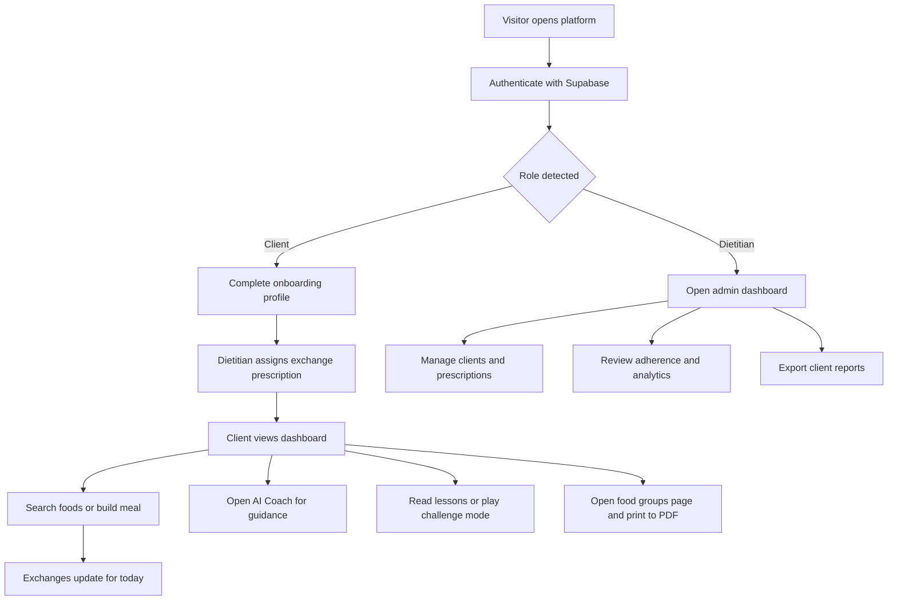

## 1. Product Overview
Premium exchange-based nutrition platform for clients and dietitians, designed as a polished healthcare SaaS with a soft pastel glassmorphism aesthetic.
- Helps clients learn and practice flexible meal planning with food exchanges while giving dietitians a clear system for adherence tracking, prescription management, and coaching.
- Targets private dietitians, nutrition clinics, and premium wellness practices that want a modern, educational alternative to rigid meal-plan apps.

## 2. Core Features

### 2.1 User Roles
| Role | Registration Method | Core Permissions |
|------|---------------------|------------------|
| Client | Email/password sign up and sign in | Complete onboarding, view dashboard, build meals, track exchanges, read lessons, use AI Coach, search foods, view food groups page |
| Dietitian (Admin) | Admin-created or invited account, email/password sign in | Manage clients, assign and edit exchange prescriptions, review adherence, view analytics, inspect meal history, export reports, use AI-assisted exchange tools |

### 2.2 Feature Module
1. **Marketing and auth surface**: premium landing experience, sign up, sign in, role-aware redirects, protected routing.
2. **Client onboarding**: age, sex, height, weight, goal, activity level collection with profile persistence.
3. **Client dashboard**: exchange cards, adherence trends, weight tracker, water tracker, recent meals, motivational message, quick add meal.
4. **Food exchange library**: searchable food catalog with categories, portions, images, equivalents, learning mode insights.
5. **Meal builder**: create meals from foods, auto-calculate exchanges, subtract from daily totals, gentle over-limit messaging.
6. **AI Exchange Coach**: conversational coaching, exchange explanations, meal-fit suggestions, natural-language meal logging, clarifying follow-up prompts.
7. **Learning center**: structured lessons, illustrations, practical tips, takeaways, educational browsing.
8. **Challenge mode**: mini learning activities with supportive feedback and no punitive wording.
9. **Admin dashboard**: client management, prescription editing, adherence analytics, progress charts, report export.
10. **Food groups page**: standalone premium web page optimized for browser print-to-PDF output while preserving hyperlinks and matching site styling.
11. **Global search**: instant cross-entity search for foods, lessons, meals, and clients for admins.
12. **Demo data system**: realistic seeded users, foods, lessons, meals, prescriptions, and chart history.

### 2.3 Page Details
| Page Name | Module Name | Feature Description |
|-----------|-------------|---------------------|
| Landing | Hero and proof sections | Soft gradient hero, premium healthcare messaging, benefits, feature previews, testimonial-style credibility blocks, CTA to auth |
| Auth | Sign up / sign in forms | Zod-validated forms, Supabase auth, role-aware messaging, polished glass cards, protected redirects |
| Onboarding | Profile intake | Multi-step or segmented form for age, sex, height, weight, goal, activity level, save to profile table |
| Client Dashboard | Exchange overview | Large floating cards with circular progress rings for starch, fruit, vegetables, protein, dairy, fat and remaining totals |
| Client Dashboard | Tracking panels | Weekly adherence chart, weight trend, water tracker, recent meals feed, daily motivation, quick add meal action |
| Food Library | Instant search and filters | Search-by-name, category filtering, food detail cards, equivalents, image thumbnails, learning mode tips |
| Meal Builder | Meal composition workflow | Add foods to breakfast/lunch/dinner/snacks, calculate exchanges live, friendly warnings when targets are exceeded, save meal to history |
| AI Coach | Conversational coaching | Exchange-aware suggestions, meal analysis, simple explanations, follow-up questions for unclear serving sizes, supportive tone |
| Learning Center | Lesson library | Topic cards, lesson details with illustrations, text, tips, and key takeaways |
| Challenge Mode | Educational mini-games | Prompt cards, exchange goals, encouraging submission feedback such as "Excellent balance" or "You're close" |
| Admin Dashboard | Client management | Searchable client list, profile drawer/page, prescription assignment, adherence review, analytics summaries |
| Admin Dashboard | Reporting | Progress charts, weekly adherence, meal history review, PDF-ready report export actions |
| Global Search | Cross-entity results | Instant results across foods, lessons, meals, and clients with contextual badges and deep links |
| Food Groups | Standalone printable page | Full-page branded food group guide with exchange tables, illustrations, anchored sections, hyperlink support, print stylesheet for PDF output without visible download framing |

## 3. Core Process
Visitor lands on the marketing page, signs up or signs in, and is routed based on role. Clients complete onboarding, receive dietitian-assigned exchange goals, then use the dashboard, food library, meal builder, AI Coach, and lessons throughout the day. Dietitians manage clients, update prescriptions, review adherence, and export reports. The food groups page acts as a standalone branded reference page that can be printed to PDF while still behaving like a normal web page.

## 4. User Interface Design
### 4.1 Design Style
- **Aesthetic direction**: premium healthcare SaaS blending Apple-grade restraint, Notion clarity, Linear precision, and editorial softness inspired by WebifySites.
- **Primary palette**: `#ede8f5`, `#e5e7ed`, white, misty lilac neutrals, pale pearl backgrounds, subtle silver-gray accents.
- **Accent behavior**: soft gradient blends, translucent panels, restrained category colors for exchange groups, no harsh saturation.
- **Surface style**: glassmorphism cards, blurred frosted panels, rounded corners between 16px and 24px, floating layers, fine borders, premium shadows.
- **Typography**: elegant, clean sans serif pairing with strong hierarchy, spacious line heights, large dashboard numerals, minimal icon usage.
- **Motion**: smooth staggered entrance animations, springy hover states, chart transitions, subtle background drift, no noisy or playful motion.
- **Layout**: desktop-first sidebar for larger screens, mobile bottom nav for client flows, generous whitespace, calm density, card-driven information clusters.
- **Healthcare tone**: supportive, clinical-but-warm, educational, never punitive or alarming.

### 4.2 Page Design Overview
| Page Name | Module Name | UI Elements |
|-----------|-------------|-------------|
| Landing | Hero | Soft gradient mesh background, floating glass panels, premium typography, refined CTA group, understated device/dashboard preview |
| Auth | Form card | Centered frosted card, clean inputs, role context, pastel shadows, subtle motion on focus and submission |
| Client Dashboard | Exchange cards | Large colorful cards, circular progress rings, floating metrics, category tinting, polished shadows |
| Client Dashboard | Analytics area | Recharts inside glass cards, soft gridlines, clean legends, muted axes, calm animation curves |
| Food Library | Search experience | Sticky search bar, instant results, category tabs, image cards, equivalent food chips, lesson insight toggle |
| Meal Builder | Composition canvas | Meal sections, draggable-feel cards or action rows, exchange summary panel, encouraging over-limit notices |
| AI Coach | Chat layout | Premium assistant panel, contextual remaining exchanges, suggestion cards, soft bubbles, trust-building educational tone |
| Learning Center | Lesson gallery | Editorial cards, illustrations, takeaway callouts, premium spacing, easy-reading content blocks |
| Admin Dashboard | Data workspace | Precision tables, profile side panels, trend charts, analytics summaries, export actions, calm executive visual language |
| Food Groups | Standalone guide | Long-form branded reference layout, anchored navigation, printable visual tables, pastel section dividers, no PDF-viewer chrome |

### 4.3 Responsiveness
Desktop-first responsive system with adaptive breakpoints for tablet and mobile. Desktop uses a fixed premium sidebar and wide analytics grid; tablet shifts to a compressed sidebar or top rail; mobile uses bottom navigation, stacked cards, sticky quick actions, and simplified charts. Touch targets remain spacious and readable across all devices.

### 4.4 Accessibility, Trust, and Content Protection Guidance
- Use semantic landmarks, keyboard-friendly navigation, visible focus states, reduced-motion support, and high-enough contrast within the pastel palette.
- The food groups page should be rendered as a normal page with a print-optimized stylesheet so generated PDFs keep the site design language and hyperlink behavior where browser PDF engines support links.
- The product should avoid displaying obvious "download PDF" framing or screenshot-oriented controls.
- Screenshot prevention cannot be guaranteed on the web. The implementation may only add soft deterrents such as disabling image dragging, discouraging context-menu saves in select areas, or watermark-ready containers if later approved.
