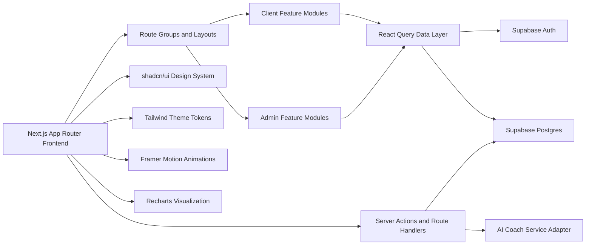
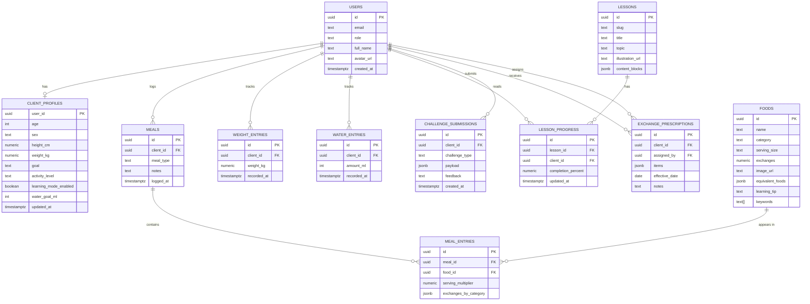

## 1. Architecture Design



## 2. Technology Description
- **Frontend**: Next.js 15 App Router + React 19 + TypeScript
- **Styling**: Tailwind CSS + shadcn/ui + custom design tokens for pastel glassmorphism surfaces
- **State and Data**: TanStack React Query for server-state caching, optimistic updates, and background refresh
- **Forms and Validation**: React Hook Form + Zod
- **Authentication**: Supabase Authentication with role-aware session handling
- **Database**: Supabase Postgres with Row Level Security
- **Charts**: Recharts
- **Animation**: Framer Motion
- **Icons**: Minimal Lucide icon usage
- **Seeding and Demo Content**: TypeScript seed scripts and SQL seed support
- **PDF Strategy**: Browser print stylesheet for `/food-groups` plus future-ready server export adapter if richer PDF generation is needed later

## 3. Route Definitions
| Route | Purpose |
|-------|---------|
| `/` | Premium landing page with product overview and role entry points |
| `/login` | Shared sign-in page for clients and dietitians |
| `/signup` | Client registration page |
| `/onboarding` | Client onboarding flow after first authentication |
| `/dashboard` | Client dashboard with exchange tracking, charts, and quick actions |
| `/dashboard/meals` | Meal builder and meal history |
| `/dashboard/foods` | Searchable food exchange library |
| `/dashboard/coach` | AI Exchange Coach experience |
| `/dashboard/learn` | Learning center and challenge mode |
| `/dashboard/profile` | Client profile, trackers, and preferences |
| `/food-groups` | Standalone branded food groups reference page with print/PDF-friendly layout |
| `/admin` | Dietitian dashboard overview |
| `/admin/clients` | Client directory and search |
| `/admin/clients/[clientId]` | Client profile, prescriptions, adherence, history, and export tools |
| `/admin/analytics` | Aggregate analytics and clinic insights |
| `/api/ai/coach` | AI Coach request handler with exchange-aware prompt orchestration |
| `/api/search` | Unified instant search endpoint for foods, lessons, meals, and clients |
| `/api/reports/[clientId]` | Report generation endpoint placeholder for future PDF/export pipeline |

## 4. API Definitions

### 4.1 Authentication and User Context
```ts
type UserRole = "client" | "dietitian";

type AppUser = {
  id: string;
  email: string;
  role: UserRole;
  fullName: string;
  avatarUrl?: string | null;
  createdAt: string;
};
```

### 4.2 Client Profile and Prescription
```ts
type ClientGoal = "fat_loss" | "maintenance" | "muscle_gain";
type ActivityLevel = "sedentary" | "light" | "moderate" | "active" | "very_active";
type ExchangeCategory = "starch" | "fruit" | "vegetable" | "protein" | "dairy" | "fat";

type ClientProfile = {
  userId: string;
  age: number;
  sex: "female" | "male" | "other" | "prefer_not_to_say";
  heightCm: number;
  weightKg: number;
  goal: ClientGoal;
  activityLevel: ActivityLevel;
  learningModeEnabled: boolean;
  waterGoalMl: number;
  updatedAt: string;
};

type ExchangePrescriptionItem = {
  category: ExchangeCategory;
  dailyTarget: number;
};

type ExchangePrescription = {
  id: string;
  clientId: string;
  assignedBy: string;
  items: ExchangePrescriptionItem[];
  effectiveDate: string;
  notes?: string | null;
};
```

### 4.3 Food Library and Meal Tracking
```ts
type FoodItem = {
  id: string;
  name: string;
  category: ExchangeCategory;
  servingSize: string;
  exchanges: number;
  imageUrl: string;
  equivalentFoods: string[];
  learningTip?: string | null;
  keywords: string[];
};

type MealFoodEntry = {
  foodId: string;
  foodName: string;
  servingMultiplier: number;
  exchangesByCategory: Partial<Record<ExchangeCategory, number>>;
};

type MealRecord = {
  id: string;
  clientId: string;
  mealType: "breakfast" | "lunch" | "dinner" | "snack";
  entries: MealFoodEntry[];
  notes?: string | null;
  loggedAt: string;
};
```

### 4.4 Dashboard and Analytics
```ts
type DailyExchangeSummary = {
  date: string;
  targets: Record<ExchangeCategory, number>;
  consumed: Record<ExchangeCategory, number>;
  remaining: Record<ExchangeCategory, number>;
};

type AdherencePoint = {
  date: string;
  adherenceScore: number;
};

type WeightEntry = {
  id: string;
  clientId: string;
  weightKg: number;
  recordedAt: string;
};

type WaterEntry = {
  id: string;
  clientId: string;
  amountMl: number;
  recordedAt: string;
};
```

### 4.5 AI Coach Contracts
```ts
type AiCoachRequest = {
  clientId: string;
  message: string;
  context?: {
    remainingExchanges?: Partial<Record<ExchangeCategory, number>>;
    recentMeals?: MealRecord[];
    mealDraft?: string;
  };
};

type AiCoachResponse = {
  reply: string;
  detectedMeal?: {
    exchangesByCategory: Partial<Record<ExchangeCategory, number>>;
    needsClarification: boolean;
    followUpQuestion?: string;
  };
  suggestions?: string[];
};
```

## 5. Application Structure
```text
src/
  app/
    (marketing)/
    (auth)/
    (client)/
    admin/
    api/
    food-groups/
  components/
    layout/
    navigation/
    dashboard/
    foods/
    meals/
    coach/
    learning/
    admin/
    shared/
    charts/
  features/
    auth/
    onboarding/
    exchanges/
    foods/
    meals/
    coach/
    lessons/
    admin/
    search/
    reports/
  lib/
    supabase/
    react-query/
    validation/
    utils/
    constants/
    demo-data/
  hooks/
  types/
  styles/
```

## 6. Data Model

### 6.1 Data Model Definition


### 6.2 Data Definition Language
```sql
create table public.users (
  id uuid primary key,
  email text not null unique,
  role text not null check (role in ('client', 'dietitian')),
  full_name text not null,
  avatar_url text,
  created_at timestamptz not null default now()
);

create table public.client_profiles (
  user_id uuid primary key references public.users(id) on delete cascade,
  age int not null check (age >= 13 and age <= 120),
  sex text not null,
  height_cm numeric(5,2) not null,
  weight_kg numeric(5,2) not null,
  goal text not null check (goal in ('fat_loss', 'maintenance', 'muscle_gain')),
  activity_level text not null,
  learning_mode_enabled boolean not null default false,
  water_goal_ml int not null default 2500,
  updated_at timestamptz not null default now()
);

create table public.exchange_prescriptions (
  id uuid primary key default gen_random_uuid(),
  client_id uuid not null references public.users(id) on delete cascade,
  assigned_by uuid not null references public.users(id),
  items jsonb not null,
  effective_date date not null,
  notes text
);

create table public.foods (
  id uuid primary key default gen_random_uuid(),
  name text not null,
  category text not null check (category in ('starch', 'fruit', 'vegetable', 'protein', 'dairy', 'fat')),
  serving_size text not null,
  exchanges numeric(5,2) not null,
  image_url text not null,
  equivalent_foods jsonb not null default '[]'::jsonb,
  learning_tip text,
  keywords text[] not null default '{}'
);

create index foods_name_idx on public.foods using gin (to_tsvector('simple', name));
create index foods_keywords_idx on public.foods using gin (keywords);

create table public.meals (
  id uuid primary key default gen_random_uuid(),
  client_id uuid not null references public.users(id) on delete cascade,
  meal_type text not null check (meal_type in ('breakfast', 'lunch', 'dinner', 'snack')),
  notes text,
  logged_at timestamptz not null default now()
);

create table public.meal_entries (
  id uuid primary key default gen_random_uuid(),
  meal_id uuid not null references public.meals(id) on delete cascade,
  food_id uuid not null references public.foods(id),
  serving_multiplier numeric(5,2) not null default 1,
  exchanges_by_category jsonb not null
);

create table public.weight_entries (
  id uuid primary key default gen_random_uuid(),
  client_id uuid not null references public.users(id) on delete cascade,
  weight_kg numeric(5,2) not null,
  recorded_at timestamptz not null default now()
);

create table public.water_entries (
  id uuid primary key default gen_random_uuid(),
  client_id uuid not null references public.users(id) on delete cascade,
  amount_ml int not null check (amount_ml > 0),
  recorded_at timestamptz not null default now()
);

create table public.lessons (
  id uuid primary key default gen_random_uuid(),
  slug text not null unique,
  title text not null,
  topic text not null,
  illustration_url text not null,
  content_blocks jsonb not null
);

create table public.lesson_progress (
  id uuid primary key default gen_random_uuid(),
  lesson_id uuid not null references public.lessons(id) on delete cascade,
  client_id uuid not null references public.users(id) on delete cascade,
  completion_percent numeric(5,2) not null default 0,
  updated_at timestamptz not null default now()
);

create table public.challenge_submissions (
  id uuid primary key default gen_random_uuid(),
  client_id uuid not null references public.users(id) on delete cascade,
  challenge_type text not null,
  payload jsonb not null,
  feedback text not null,
  created_at timestamptz not null default now()
);
```

## 7. Security and Protected Route Strategy
- Use Supabase middleware and server-side session checks in App Router layouts.
- Gate all `/dashboard/*` routes to authenticated `client` users and all `/admin/*` routes to authenticated `dietitian` users.
- Enforce Row Level Security so clients can only read and write their own profiles, meals, weights, water entries, and lesson progress.
- Allow dietitians to manage client-linked records only for authorized admin role accounts.
- Store no screenshot or download guarantees in security promises, because browsers cannot reliably prevent either action.

## 8. Scalability and Future-Ready Decisions
- Keep business logic in `features/*` modules so future AI meal suggestions, chat with dietitian, recipe builder, and shopping list features can plug into existing domains.
- Centralize exchange calculations in a reusable `exchanges` service layer used by dashboard, meal builder, AI Coach, and admin tools.
- Prepare theme tokens and directional utilities for later dark mode and Arabic RTL support.
- Use route handlers and service adapters so barcode scanning, push notifications, subscriptions, and offline sync can be added without large route rewrites.
- Design the `food-groups` page as a normal content route sharing the same design system so hyperlinks, navigation, and future localization remain first-class.
